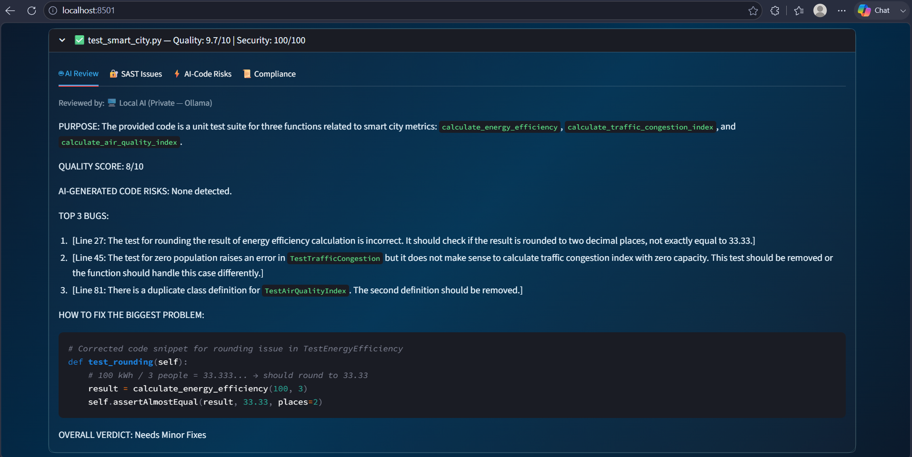
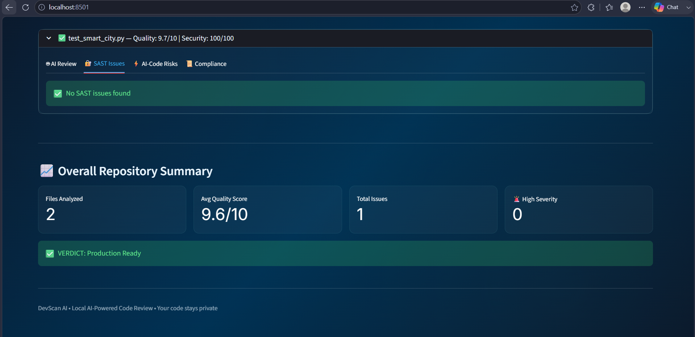

<div align="center">

# 🔍 DevScan AI

### Find bugs in AI-generated code before they reach production.
### Runs 100% on your machine. Zero code sent anywhere. Ever.

[]()
[]()
[]()
[]()

</div>

---

<div align="center">




</div>

---

## The Problem

Every AI coding tool introduces the same bugs.

Not random bugs. Specific, repeating patterns that
normal linters were never built to catch:

- **Hallucinated APIs** — functions that look real but do not exist
- **Silent error handling** — exceptions caught and ignored
- **Hardcoded secrets** — credentials sitting in plain text
- **Insecure defaults** — configurations that look safe but are not
- **SQL injection** — introduced through autocomplete patterns
- **Broken authentication** — subtle logic errors that bypass security

DevScan AI was built specifically to find these.

---

## Why DevScan?

Every cloud-based code review tool works
the same way — your code travels to
their servers for analysis.

Your source code is your intellectual property.
Your business logic. Your competitive advantage.

DevScan runs entirely on your own machine.
Nothing leaves. Nothing is logged. Nothing is stored.
Zero trust required.

---

## What You Get Per Scan

| Feature | Description |
|---|---|
| 🛡️ Security Score | 0-100 with exact file names and line numbers |
| 📊 Quality Score | 0-10 based on real code metrics |
| 🤖 AI-Risk Detection | 8 patterns specific to AI coding tool mistakes |
| 🔍 Deep AI Review | Purpose, top bugs, fix suggestions, verdict |
| 📜 SAST Analysis | Bandit security scanner built in |
| 📋 Compliance Check | Upload your own team coding standards |
| 💰 ROI Dashboard | Track bugs found and cost saved |

> Scores are deterministic — same code always gives same score.

---

## Choose Your Model

| Model | RAM Needed | Storage | Speed (CPU) | Speed (NVIDIA GPU) | Accuracy |
|---|---|---|---|---|---|
| qwen2.5-coder:7b | 5GB free | 5GB | 60-90 sec/file | 10-15 sec/file | Good |
| qwen2.5-coder:14b | 10GB free | 9GB | 3-5 min/file | 10-20 sec/file | Excellent |

Run whichever your machine supports.
Default is 7b — works well on most machines.
Switch to 14b for deeper analysis if your machine supports it.

To switch — open `.env` file and change:
```env
OLLAMA_MODEL=qwen2.5-coder:7b
```
or
```env
OLLAMA_MODEL=qwen2.5-coder:14b
```

---

## System Requirements

| | 7b Model | 14b Model |
|---|---|---|
| RAM | 8GB minimum | 16GB minimum |
| Storage | 8GB free | 12GB free |
| OS | Windows, Mac, Linux | Windows, Mac, Linux |
| GPU | Optional | Optional — NVIDIA recommended |

---

## Quick Start — Easiest Way

> 💡 This works on Windows, Mac, and Linux.
> No Docker needed.

**Step 1 — Install Ollama:**

Download and install from [ollama.com](https://ollama.com)

**Step 2 — Clone DevScan AI:**
```bash
git clone https://github.com/suzana92/devscan-ai.git
cd devscan-ai
```

**Step 3 — Install requirements:**
```bash
pip install -r requirements.txt
```

**Step 4 — Run DevScan:**

Windows — double click `setup.bat`

Mac and Linux:
```bash
chmod +x setup.sh
./setup.sh
```

**Step 5 — Open browser:**
http://localhost:8501

> First run downloads the AI model (5GB for 7b).
> Takes 5-10 minutes once. Never again after that.

---

## Running Every Time After Setup

Windows — double click `setup.bat`

Mac and Linux:
```bash
ollama serve
streamlit run app.py
```

Open **http://localhost:8501**

---

## Docker Option

Prefer Docker? Make sure Ollama is installed and running, then:

```bash
docker compose up
```

Open **http://localhost:8501**

---

## How It Works

Paste any public GitHub repository URL
DevScan fetches the code via GitHub API
Bandit SAST scans for security vulnerabilities
Local Ollama AI does deep code review
Full private report appears in your browser


Everything runs on your machine.
The AI model never calls home.
Your code never moves.

---

## Privacy

Gemini cloud backup is available as an optional feature.
It is **OFF by default**.
Your code never leaves your machine unless
you explicitly enable Gemini in the sidebar settings.

When Gemini is off — zero external connections. Ever.

---

## Project Structure
devscan-ai/

├── app.py                    — Main interface

├── ai_reviewer.py            — Local AI engine (Ollama)

├── sast_scanner.py           — Security scanner (Bandit)

├── github_reader.py          — GitHub repository reader

├── compliance.py             — Coding standards checker

├── analytics.py              — ROI dashboard

├── security.py               — Rate limiting and sanitization

├── docker-compose.yml        — Docker for personal use

├── docker-compose.server.yml — Docker for team servers

├── setup.bat                 — Windows one-click start

├── setup.sh                  — Mac and Linux one-click start

└── dockerfile                — App container

---

## Roadmap

- [ ] Private repository support
- [ ] VS Code extension
- [ ] GitHub Actions CI/CD integration
- [ ] JavaScript, TypeScript, Go, Java scanning
- [ ] Team dashboard with multi-user support
- [ ] Automated PR review bot

---

## For Development Teams

DevScan AI deploys on your team's own server.
Every developer accesses it through their browser.
Your code never leaves your building.

📧 Contact for team and enterprise licensing:
**suzanasehanaz@gmail.com**

---

## Support This Project

If DevScan found a real bug in your codebase —
please ⭐ **star this repository**.

It helps other developers find this tool.

---

<div align="center">

*Built by **Suzana Sehanaz** — Founder, DevScan AI*

*Privacy-first AI code review that take security seriously.*

</div>
